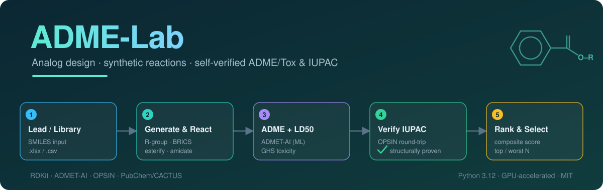

<p align="center">
  
</p>

# ADME-Lab

**Analog design · synthetic reactions · self-verified ADME/Tox & IUPAC prediction**

A cheminformatics toolkit to **design and enumerate molecules** (*R-group*
decoration, BRICS and an **extensible reaction engine**), **predict ADME and
LD50**, assign **self-verified IUPAC names** and **select** candidates with a
configurable score. Built to grow: adding a reaction type is adding one entry to
a catalog.

---

## What it does

| Stage | Module | What you get |
|-------|--------|--------------|
| **Generate** analogs | `admelab.generation` | *R-group* position decoration with control over the **site** and the **number of substitutions**, plus **BRICS** recombination. |
| **React** (extensible engine) | `admelab.reactions` · `admelab.esterification` | Targeted *core + partner* SMARTS reactions that **preserve stereochemistry**, validated by **exact atomic formula**. Includes **esterification** (with OH classification and **Fischer viability**) and **amidation**; adding a reaction = adding an entry to the `REACTIONS` catalog. Audits against a previous list and **name ↔ structure**. |
| **Predict ADME** | `admelab.predict` | Layer 1: RDKit descriptors + rules (Lipinski, Veber, Egan, ESOL, QED, PAINS/Brenk). Layer 2: **ADMET-AI** (~41 ML endpoints). |
| **LD50 toxicity** | `admelab.toxicity` | LD50 (ADMET-AI) → **mg/kg** + **GHS** acute oral toxicity category. |
| **IUPAC name** | `admelab.naming_smart` | **Self-verified** by *round-trip* (OPSIN): provenance offline + PubChem + CACTUS; an `iupac_verified` column guaranteeing the name reconstructs the structure. |
| **Rank/select** | `admelab.ranking` | **Composite score** (max/min/target with weights) + **range filters** + *top*/*worst* N. |
| **Visualize** | `admelab.viz` | Structure grid, scatter, profile radar, histograms, change highlighting. |
| **All together** | `admelab.pipeline` | `run_pipeline(...)` chains the whole flow. |

Two example notebooks: **`ADME_Lab.ipynb`** (analog design from a lead) and
**`Reactions_Demo.ipynb`** (esterification + amidation + ADME, self-contained).

---

## Environment

- **WSL Ubuntu 24.04**, Python 3.12, virtual environment in `./.venv`.
- Key dependencies: `rdkit`, `admet-ai` (torch/chemprop, uses **GPU** if present),
  `pandas`, `matplotlib`, `pubchempy`, `jupyterlab`.
- ML prediction leverages the GPU (tested on an RTX 4060) and falls back to CPU.

## Installation

**Option A — `pip` (package):**

```bash
python -m venv .venv && source .venv/bin/activate
pip install -e .          # installs admelab + dependencies (rdkit, admet-ai, ...)
bash tools_setup.sh       # (optional) portable JRE + OPSIN for verified naming
```

**Option B — reproducible script (WSL without `sudo`):**

```bash
bash setup_env.sh         # creates .venv with embedded pip and installs by layers
bash tools_setup.sh       # Adoptium JRE + OPSIN into tools/
```

> The 1st prediction downloads the ADMET-AI weights. Without OPSIN
> (`tools_setup.sh`), naming falls back to PubChem/CACTUS **without** structural
> verification.

## Usage

### Option A — Notebook (recommended)

```bash
source .venv/bin/activate
jupyter lab ADME_Lab.ipynb        # or Reactions_Demo.ipynb
```

Edit `LEAD` (your SMILES) and run top to bottom.

### Option B — Python API

```python
from admelab import pipeline, reactions

# Analog design + ADME/Tox
r = pipeline.run_pipeline(
    "CC(C)Cc1ccc(C(C)C(=O)O)cc1",       # ibuprofen
    methods=("decoration", "brics"),
    n_substitutions=[1, 2],              # mono and di-substitution
    positions=None,                      # None = auto; or [10, 12] to direct
    filters={"MW": (None, 500), "LD50_mg_per_kg": (300, None)},
)
print(f"{r.n_generated} analogs generated")
r.ranked.head(10)[["SMILES", "score", "MW", "LogP", "LD50_mg_per_kg", "GHS_category"]]

# Targeted reaction of one acid with a partner library
amides = reactions.react_library(
    "OC(=O)c1ccccc1", ["NCc1ccccc1", "C1COCCN1"],
    reaction="amidation", policy="first",
)
```

---

## Structure

```
admelab-repo/
├── admelab/                # installable package
│   ├── generation.py       # analogs: R-group decoration + BRICS
│   ├── reactions.py        # extensible reaction engine (SMARTS catalog)
│   ├── esterification.py   # esterification (OH/Fischer) + audits
│   ├── predict.py          # ADME: RDKit descriptors + ADMET-AI (ML)
│   ├── toxicity.py         # LD50 → mg/kg + GHS category
│   ├── naming.py           # basic IUPAC: PubChem → CACTUS
│   ├── naming_smart.py     # self-verified IUPAC: provenance + OPSIN round-trip
│   ├── ranking.py          # composite score, filters, top/worst
│   ├── viz.py              # grids and plots
│   └── pipeline.py         # run_pipeline(): full flow
├── ADME_Lab.ipynb          # demo: analog design from a lead
├── Reactions_Demo.ipynb    # demo: esterification + amidation + ADME (self-contained)
├── pyproject.toml          # packaging (pip install -e .)
├── requirements.txt        # dependencies with tested versions
├── setup_env.sh            # reproducible environment install (WSL, no sudo)
├── tools_setup.sh          # JRE + OPSIN install (verified naming)
├── LICENSE · CITATION.cff · README.md
└── tools/                  # (generated) portable JRE + opsin.jar — NOT versioned
```

---

## Notes and limitations

- **Self-verified IUPAC naming**: every name passes a *round-trip* (name → OPSIN
  → structure → InChIKey) and is only flagged `iupac_verified=True` if it
  reconstructs the exact molecule. For the analogs we generate by decoration the
  name is built **offline** from the lead's (fast, no network); PubChem and
  CACTUS cover the rest. This guarantees *structural correctness*, not
  necessarily the single *Preferred IUPAC Name*.
  - Note: STOUT (an ML SMILES→IUPAC model) was dropped because `STOUT-pypi`
    requires `tensorflow==2.10.1`, incompatible with Python 3.12. The provenance
    + OPSIN approach gives higher (verifiable) precision without that dependency.
- **LD50**: the *Zhu* endpoint (acute oral toxicity) is predicted. The mg/kg
  conversion uses the molecular weight; calibrated with reference drugs
  (acetaminophen ~2274 mg/kg pred. vs ~1944 exp.; ibuprofen ~756 vs ~636).
- ADMET-AI predictions are **estimates** to **prioritize**, not a substitute for
  experimental assays.
- PubChem and CACTUS are **web queries**: the cascade uses them only when the
  offline provenance path does not cover a molecule.

---

## What is NOT in the repository

These items are heavy or carry licenses that forbid redistribution; they are
**recreated** by the install scripts (`setup_env.sh`, `tools_setup.sh`):

| Item | Size | How to obtain |
|------|------|---------------|
| `.venv/` (environment + PyTorch) | ~5.5 GB | `bash setup_env.sh` |
| `tools/` (Adoptium JRE + OPSIN) | ~172 MB | `bash tools_setup.sh` |
| ADMET-AI weights | ~hundreds MB | downloaded on the 1st prediction |

> The **Adoptium/Temurin JRE** is GPLv2 + Classpath Exception: do **not** commit
> it. `tools_setup.sh` downloads it on the user's machine.

---

## Credits and citations

The **ADME-Lab** code is original (MIT license) but relies on these open-source
tools. If you use it in research, please cite them:

- **RDKit** — Open-source cheminformatics, <https://www.rdkit.org> (BSD-3)
- **ADMET-AI** — Swanson, K. *et al.*, *Bioinformatics*, 2024 (MIT)
- **Chemprop** — Yang, K. *et al.*, *J. Chem. Inf. Model.*, 2019; Heid, E. *et al.*, 2024 (MIT)
- **Therapeutics Data Commons (TDC)** — Huang, K. *et al.*, *NeurIPS Datasets & Benchmarks*, 2021 (ADMET and LD50 data)
- **OPSIN** — Lowe, D. M. *et al.*, *J. Chem. Inf. Model.*, 2011, 51, 739 (MIT)
- **PubChem** — Kim, S. *et al.*, *Nucleic Acids Res.* · **CACTUS/CADD** (NCI)

*(Verify volume/page when formatting the references.)*

---

## License

Distributed under the **MIT** license — see [LICENSE](LICENSE). Dependencies keep
their own licenses (all permissive; the JRE, obtained separately, is GPLv2+CE).

## Development

Developed with AI assistance (Claude, Anthropic); the design, chemical
validation and scientific direction are the author's.
